# Heap - Handle

### To do list:
- [X] Actualizar nota;
- [x] Sacar estudiante;
- [x] Sacar peor nota;
- [x] Meter examenes;


### Estructura del heap con un handle;
```java
var heap; // array de estudiantes
var handle; // handle[id] = indice del estudiante en el heap
var size; // cantidad de elementos
```
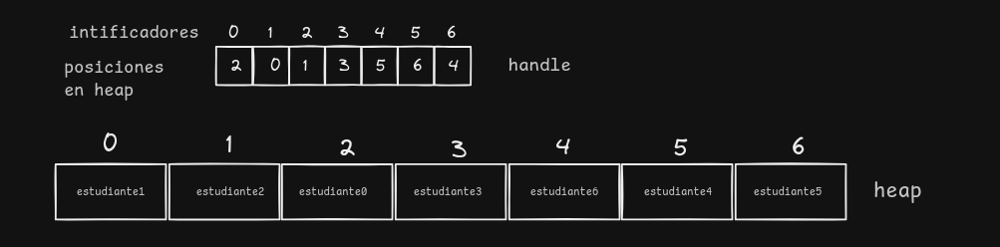
```java
class Estudiante{
    int id;
    int cantidadDeRespuestasCorrectas; //  necesario para resolver
    Array[int] examen;
}
```

handle -> [donde esta en el heap]

heap -> estudaintes con prioridad en peor nota

Necesito que esta estructura haga:
- Acceder al examen en O(1)
- Actualizar la nota en O(log E)
- Eliminar directamente en O(log E)

### Acceder a examen:

```java
// como el handle me proporciona la ubicación de donde se encuentra el examen en el heap, entonces puedo hacer:
proc obtenerExamen(in idEstudiante){
    var ubicacion = handle[idEstudiante]
    var examen = heap[ubicacion]
}
```
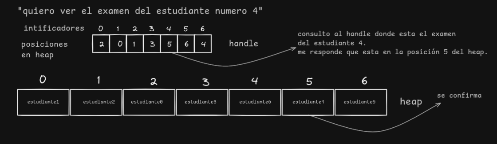


### Meter examenes 
```java
proc insertar(in estudiante:Estudiante){
    heap[size] = estudiante; // insertar el examen al final del heap;
    handle[estudiante.id] = size; // guardar donde esta el examen.
    ordenarHeap(heap);
    size++; //<- Nuevo elemento
}
```
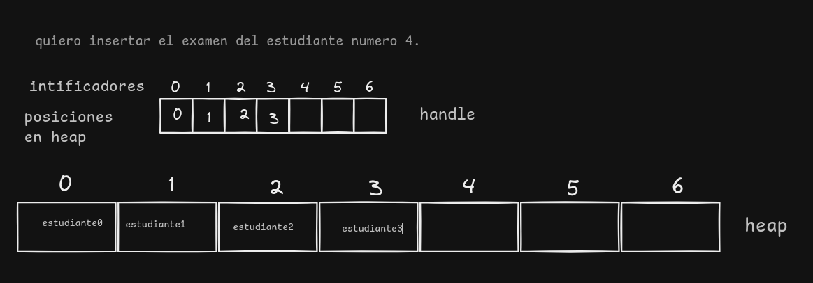
> estamos poniendolo en el final porque en este caso se esta armando el EdR todos tienen la misma nota 0, y deempato por id.
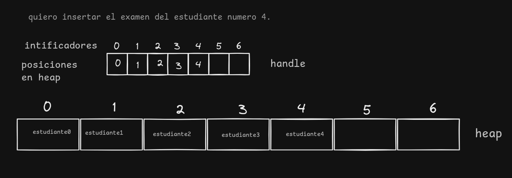

### consultar las peores notas:
> - objetivo: Encontrar los k peores estudiantes.
> - obstaculo: necesito que sea en tiempo O(1).

depende de lo que quiera hacer.
```java
func kPeoresEstudiantes(k){
    var list : listaEnlasada<Examenes> := new listaEnlasada();
    int i = 0;
    while (i < k){
        list.agregarRapido(heap.desencolarPeorNota())
        // desencolar se encarga de actualziar el handle
    }endwhile
    if(quieroQueSemantengaElHeap){
        actual = lista.raiz;
        while(lista.haySiguiente()){
            heap.enconlar(actual.valor);
            actual = actual.siguente();
        }
        return lista;
    }else{
        return lista;
    }
}

```
Esta implementacion toma en cuenta el proceso de k parciales para la darkweb. porque puede ser que quiera los k examenes para modificarlos y despues ponerlos, ahí me sirve que el heap se vaya vaciando.
> Objetivo
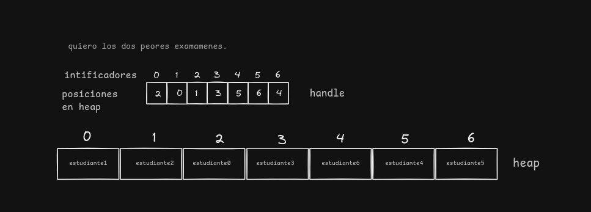

> 1°


> 2°
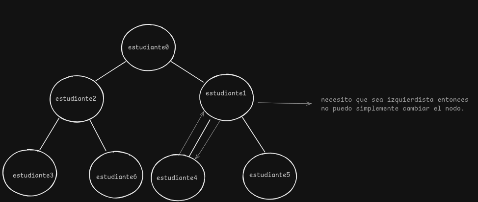

> 3°
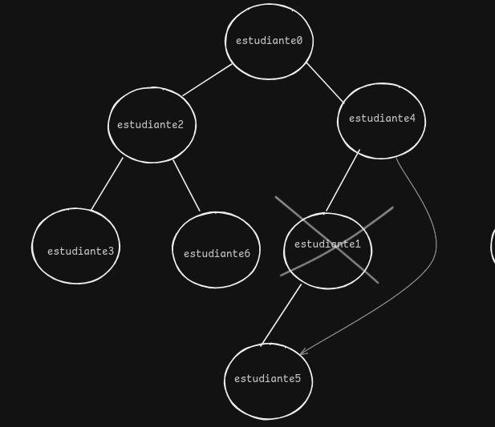

> 4°
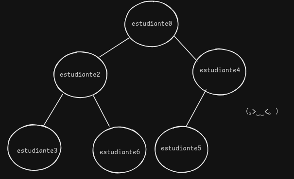

> 5°
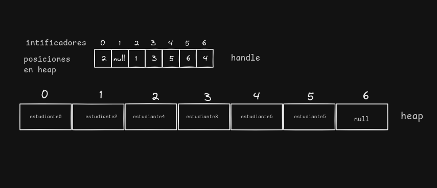

> Para sacar al segundo seguiria el mismo proceso.
### Eliminar estudiante


```java
proc eliminarEstudiante(in idEstudiante:int){// se va del aula
    var indiceDelheap = handle[idEstudiante]
    cambiarElementos(heap[indiceDelHeap], heap[size - 1]) // pongo al estudiante que quiero eliminar al final.
    
    // actualizar el handle luego del intercambio;
    actualizarHandles()
    // seria cambiar la posicion de nodo final con el que quiero eliminar.
    
    // elimino el nodo final (Porque es estudiante que quiero sacar)
    size--;
    heap.eliminarUltimoNodo(); 

    // como rompimos el invariante luego corregimos la posición.
    ordenarArbol(i);// se encarga de actualizar el handle
}
```
Dibujo:
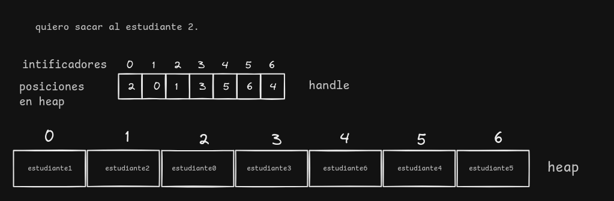
> lo pongo al final.
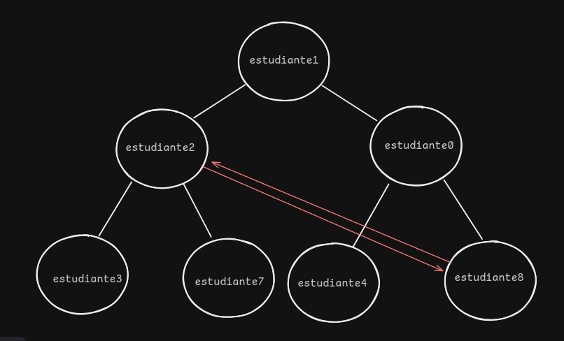

> Elimino el último
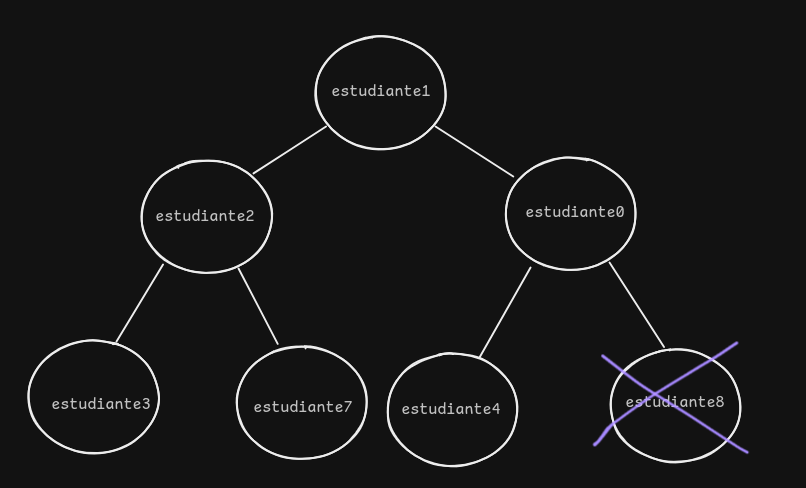

> Mantengo el invariante
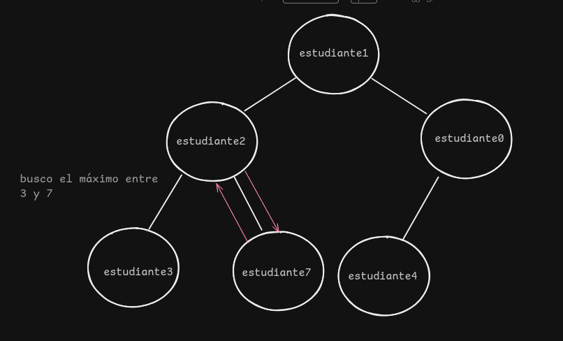

> Resultado
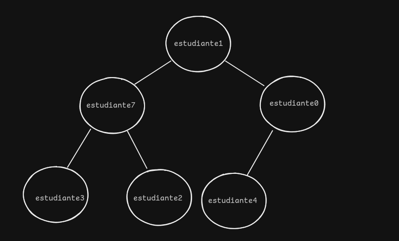

> handle - array heap
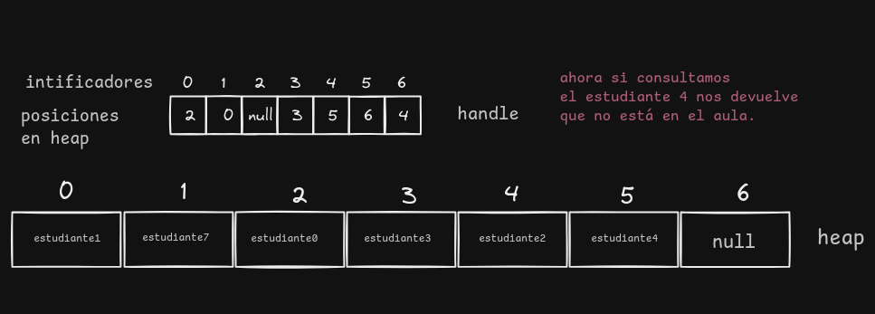


### ¿Actualizar examen? por qué no? (resolver o consultar dw)
> como tal para actulizar el heap solo necesito ver si la nota aumento o si bajo.

entonces:
```java
func actualizarHeap(inout heap; in indice:int){
    if(laNuevaNota > alPadre){
       intercambio nodos;
       actualizar el handle
    }if(laNuevaNota < alguno de sus hijos){
        lo intercambio con el menor
        actualizar el handle
    }
}
```
> Enunciado
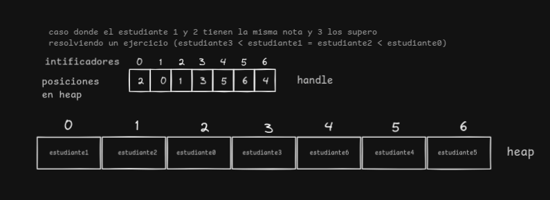

> estudiante 3 tiene peor nota que estudiante 2
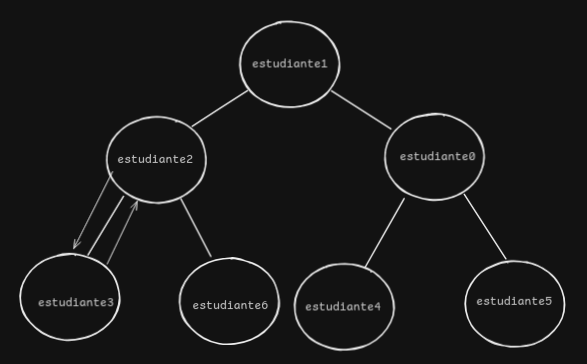

> estudainte 3 tiene peor nota que estudiante 1
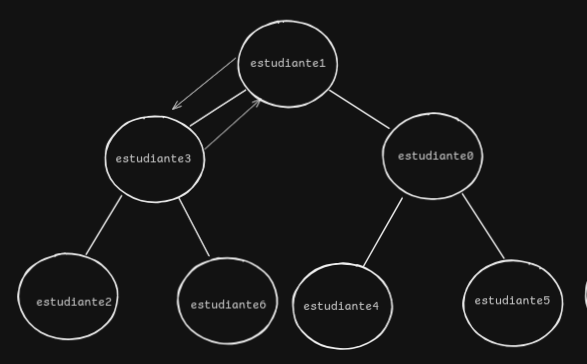

> estudiante 3 es la nueva raíz 
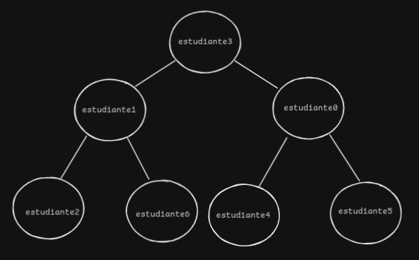

> resultado
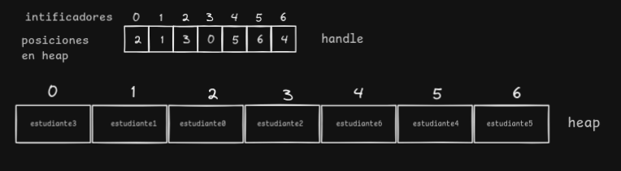